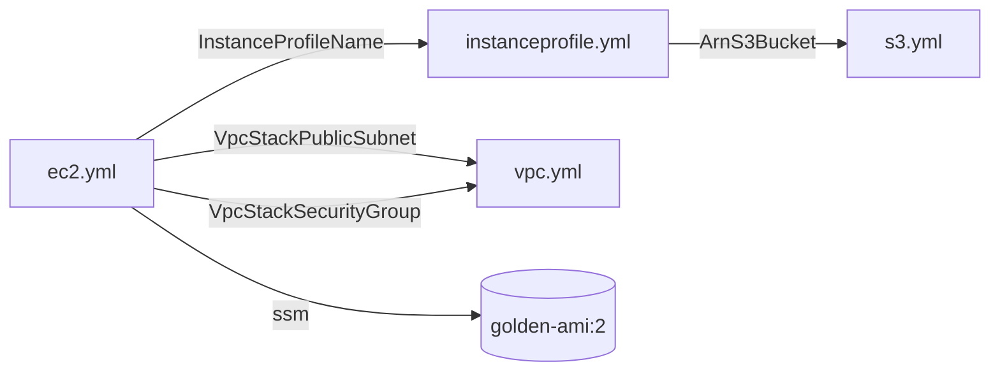
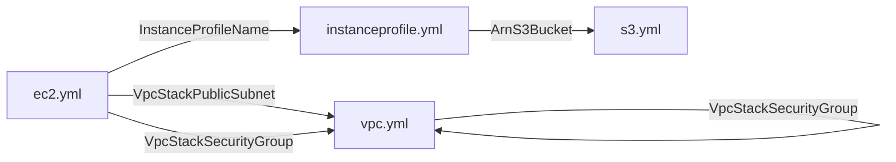

# AWS CloudFormation Template Dependency Visualization

Parses the following from a YAML formatted CFn template file and outputs dependencies in Mermaid format:

- Export and ImportValue
- dynamic references
  - Getting the entire secret for MySecret, such as {{resolve:secretsmanager:MySecret}}, is not supported.
  - In Mermaid output, dynamic reference dependencies are drawn as cylindrical shape nodes.
  - The edge label (arrow label) in Mermaid is the service name:
    `ssm`, `ssm-secure`, or `secretsmanager`, and the node name is only the parameter part of the dynamic reference.

## Install

Python 3.12+ is supported.

Install it using pipx.

```bash
pipx install git+https://github.com/jay34986/cfn-template-dependency-visualization.git
```

## Basic Usage

If you run the cfn-tdv command without any arguments, it analyzes files with .yaml and .yml extensions in the current directory.  
The analysis results are output to standard output in Mermaid format as shown below.  
The following example shows that s3import.yaml references MyBucketExportName, which is exported in s3export.yaml.  



Use the `-d` option to specify the directory where the CFn templates are saved.  

```bash
cfn-tdv -d examples/yaml/
```

To output the analysis results to a file, specify the `-o` option.  

```bash
cfn-tdv -o result.md
```

You can specify the direction of the Mermaid diagram using the `-D` or `--direction` option.  
The default is `LR` (left to right).  
You can also choose `BT` (bottom to top).

- `-D LR` : Left to right (default)
- `-D BT` : Bottom to top

```bash
cfn-tdv -D BT
```

## Detecting self-references

If an ImportValue circularly references an Export within its own CFn template, a WARNING is issued.  
If there are multiple circular references, multiple WARNING will be printed.  
However, a Mermaid diagram can only represent one circular reference per CFn template.  
In the example below, there are two warnings about circular references in vpc.yml,
but the Mermaid diagram only has one line drawn from vpc.yml to vpc.yml.  

```text
cfn-tdv -d examples/yml
[WARNING] examples/yml/vpc.yml references its own Cfn template's Export(VpcStackSecurityGroup) using Fn::ImportValue or !ImportValue.
[WARNING] examples/yml/vpc.yml references its own Cfn template's Export(VpcStackPublicSubnet) using Fn::ImportValue or !ImportValue.
```



## Output order is stable

The dependency lines in the Mermaid output are sorted by file name, export name, and dynamic reference content.  
This ensures that the output order is stable and does not change between runs.
