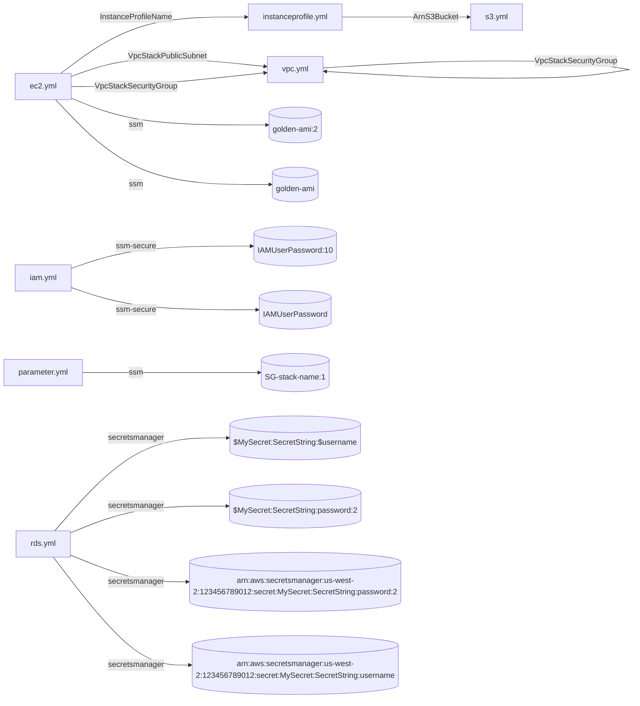

# CFn template dependency

```mermaid
graph LR
    ec2.yml-->|InstanceProfileName|instanceprofile.yml
    ec2.yml-->|VpcStackPublicSubnet|vpc.yml
    ec2.yml-->|VpcStackSecurityGroup|vpc.yml
    ec2.yml-->|ssm|golden-ami:2[(golden-ami:2)]
    ec2.yml-->|ssm|golden-ami[(golden-ami)]
    iam.yml-->|ssm-secure|IAMUserPassword:10[(IAMUserPassword:10)]
    iam.yml-->|ssm-secure|IAMUserPassword[(IAMUserPassword)]
    instanceprofile.yml-->|ArnS3Bucket|s3.yml
    parameter.yml-->|ssm|SG-stack-name:1[(SG-stack-name:1)]
    rds.yml-->|secretsmanager|$MySecret:SecretString:$username[($MySecret:SecretString:$username)]
    rds.yml-->|secretsmanager|$MySecret:SecretString:password:2[($MySecret:SecretString:password:2)]
    rds.yml-->|secretsmanager|arn:aws:secretsmanager:us-west-2:123456789012:secret:MySecret:SecretString:password:2[(arn:aws:secretsmanager:us-west-2:123456789012:secret:MySecret:SecretString:password:2)]
    rds.yml-->|secretsmanager|arn:aws:secretsmanager:us-west-2:123456789012:secret:MySecret:SecretString:username[(arn:aws:secretsmanager:us-west-2:123456789012:secret:MySecret:SecretString:username)]
    vpc.yml-->|VpcStackPublicSubnet|vpc.yml
    vpc.yml-->|VpcStackSecurityGroup|vpc.yml
```
